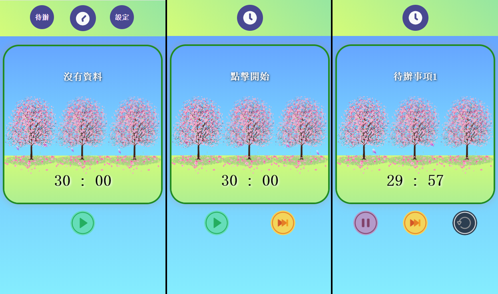
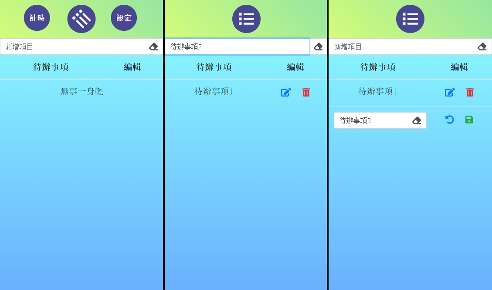
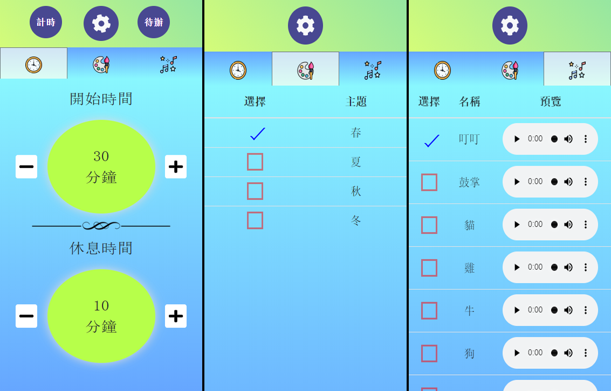

# Pomodoro 番茄鐘

## 首頁 Home

#### 倒數計時工作時間及休息時間
#### 下方按鈕由左至右分別為：開始 -> 跳過 -> 重新計時

---

## 待辦事項清單 List
#### 輸入待辦事項後按下Enter新增項目
#### 所有項目皆可修改、刪除
#### 待辦事項可以上下拖曳

---

## 設定 Setting
#### 左至右分別為時間設定、主題選擇及鈴聲選擇

---

## Demo
https://laura-chou.github.io/Pomodoro/

