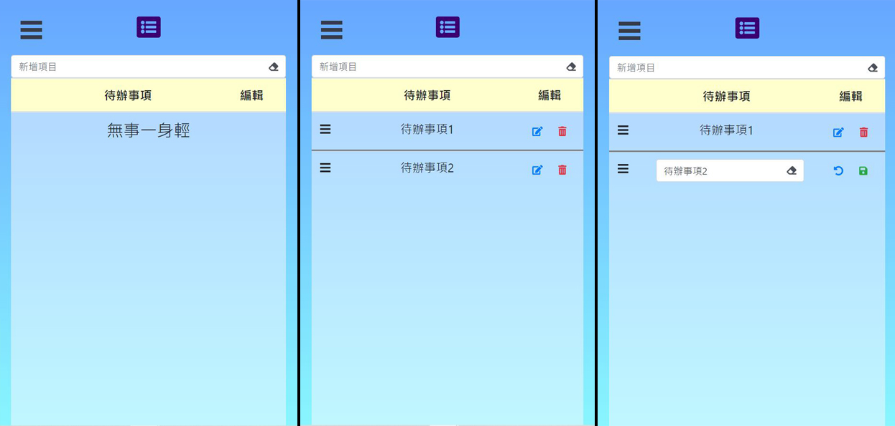

# Pomodoro 番茄鐘

### 首頁 Home

#### 倒數計時工作時間及休息時間
#### 可使用開始、暫停、重新計時及跳過功能

---

### 待辦事項清單 List
#### 輸入待辦事項後按下Enter新增項目
#### 所有項目皆可修改、刪除及上下拖曳調整順序

---

### 設定 Setting
#### 可設定工作及休息時間、主題選擇及鈴聲選擇

---

## Demo
https://laura-chou.github.io/Pomodoro/
